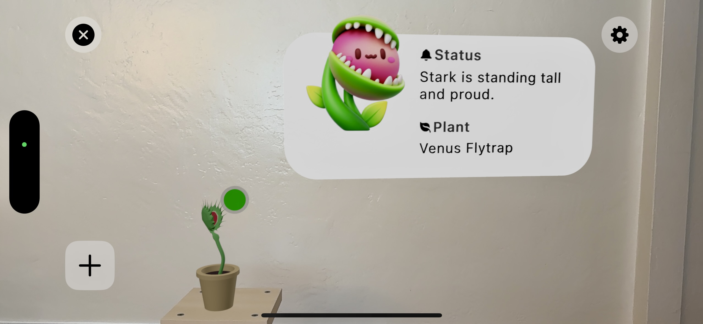

# Loud Plants in Your Area Demo

**Loud Plants in Your Area** is an Augmented Reality (AR) application that helps combat "plant blindness" – the tendency to overlook plants as mere background décor. It is designed for urban residents with limited exposure to nature, allowing them to perceive plants as living beings with feelings. The app uses AR visualizations to reveal a plant’s **mood** or status in real time. By (conceptually) capturing subtle signals or “sounds” from plants and interpreting them with AI, the app overlays engaging indicators and information on each plant through an AR view. This way, users can **“hear” and see how plants feel**, encouraging empathy and a stronger human-plant connection.



## Features

* **Plant Mood Visualization:** When looking at a plant through the AR camera, the app displays visual cues reflecting the plant’s current status or mood. This makes caring for plants interactive and fun, especially for people in cities who might not otherwise notice plant health.
* **Color-Coded Status Dots:** Every plant in view shows a floating colored dot as a quick health indicator. A green dot means the plant is happy/healthy, while an orange (or red) dot means the plant is distressed and might need attention. These AR indicators appear anchored above the plants, giving an immediate sense of each plant’s well-being.
* **Animated Environmental Feedback:** In future iterations, the AR experience can include ambient effects around the plant to match its mood – for example, gentle **sparkles** when a plant is thriving or a tiny **rain cloud** when a plant is “sad.”
* **Interactive Mood Card Overlay:** As you approach a plant, a detailed status card **pops up** in AR next to it. This floating panel displays the plant’s name and species, a personalized mood description, and even a cute avatar image reflecting the plant’s emotion. For example, you might see *“Fernanda is basking in sunlight with joy”* alongside a smiling plant icon.
* **Plant Selection and Placement:** The app includes a library of virtual plant models. Users can tap a **+** icon to open a **plant picker** – a grid of plant thumbnails – and choose a plant to place into their AR scene. Once selected, the 3D model of that plant appears anchored on the floor or a surface in front of the user. You can place multiple plants and see each one’s status indicators.
* **Dynamic Focus and Scale:** The AR session tracks the user’s distance to each plant. As you move closer to a particular plant, that plant becomes the “focused” plant – triggering its status card to appear. This creates a seamless experience where information on the nearest plant is presented at the right time.
* **Settings Panel:** A built-in settings menu (accessible via a **gear icon**) lets users tweak the AR experience. Currently, you can toggle the visibility of the 3D plant models (e.g., hide the virtual plant while still seeing its status indicators) and toggle whether the status cards always face the camera. The settings are presented in a simple SwiftUI form sheet with toggles.
* **Demo Mode & Welcome Screen:** On launch, the app shows a welcome screen with the app name and a brief description of the experience. From there, users can enter the AR demo. The entire project is set up as a **demo/prototype** – no real sensor or audio hardware is required. Plant “feelings” are simulated using preset data, but the architecture is ready to integrate real data (e.g. from a plant AI or sensor API) in the future.

## Technologies Used

* **Swift & SwiftUI:** The app is written in Swift using SwiftUI for all user interface elements. SwiftUI provides the declarative UI for the welcome screen, settings sheet, plant picker, and overlays for buttons. It also allows integrating the AR view seamlessly using `UIViewRepresentable`.
* **ARKit & RealityKit:** Leveraging Apple’s ARKit for world tracking and camera access, the app brings plants into AR space. RealityKit is used to render 3D content like plant models and status dot indicators. ARKit handles plane detection and anchoring, while RealityKit manages the 3D scene and animations. For example, when a user places a plant, ARKit finds a surface via a raycast and RealityKit anchors the virtual plant there.
* **Combine Framework:** The app uses Swift’s Combine for reactive programming. The plant data store (`PlantStore`) is an `ObservableObject` with `@Published` properties, allowing the UI and AR overlay logic to automatically react to changes (such as a plant’s status updating). The `OverlayPresenter` uses Combine’s publishers to listen for the currently focused plant and for any status changes, so it can update the AR overlay in real time.
* **MVVM Architecture with Coordinators:** The project follows the Model-View-ViewModel pattern for separation of concerns. Models represent plant data (e.g. `Plant` struct), ViewModels handle logic (e.g. `DemoViewModel` prepares data for the AR view and interacts with services), and SwiftUI Views render the UI. There is a simple Coordinator (`AppCoordinator`) managing navigation state.
* **RealityKit 3D UI Elements:** To create the AR status card overlay, the app uses RealityKit to generate 3D UI elements. For instance, `OverlayFactory` builds a card by creating a textured plane for the background, adding 3D text entities for each line of info, and embedding SF Symbols and an avatar image onto the 3D card. These elements are positioned and scaled in 3D coordinates to appear as a single “card” floating next to the plant.
* **iOS Platform:** This project targets **iOS 16+** (using features from iOS 16 and 17). It requires a device that supports ARKit. The app was developed and tested using Xcode (the iOS simulator does not fully support ARKit camera functionality, so a real device is recommended).

## Installation and Run Instructions

To run **Loud Plants in Your Area** on your device or simulator:

1. **Clone the repository:** Download or clone this repository to your local machine.
2. **Open in Xcode:** Navigate to the project folder and open the `LoudPlants.xcodeproj` file in Xcode. (You can also open the workspace if one exists, but for this project the `.xcodeproj` should suffice.)
3. **Check Target Settings:** Ensure the target platform is set to an ARKit-compatible iOS device. You may need to select your Team for code signing if running on a physical device. Also, make sure the deployment target (in Project settings) matches your device’s iOS version.
4. **Build & Run:** Build the app (`Cmd+B`) and run it (`Cmd+R`) on an **iPhone/iPad device**. If using a simulator, note that AR features will show a static camera feed (ARKit cannot capture real environment in simulator). On a device, grant Camera access when prompted (the app requires camera permission for AR). Once launched, tap "Start Demo" on the welcome screen to enter the AR experience.
5. **Using the App:** Move your device around so ARKit can detect surfaces. Tap the **“＋”** button to add a virtual plant at the center of the view. You can add multiple plants one by one. Walk closer to a plant to see its status card appear. Use the **gear** button to open settings if you want to toggle features. Use the **“✕”** button to exit the AR demo. Enjoy interacting with your loud (and hopefully happy) plants!

## Project Structure

Below is an overview of the project’s directory structure, with key files and their roles:

```plaintext
LoudPlantsInYourArea/
├─ LoudPlants.xcodeproj/               # Xcode project configuration (targets, build settings, etc.)
├─ LoudPlants/                         # Source code for the iOS app (Swift/SwiftUI files)
│  ├─ LoudPlantsApp.swift             # App entry point (@main) – sets up environment objects and initial view
│  ├─ AppCoordinator.swift            # Coordinator for navigation (manages the SwiftUI NavigationStack path)
│  │
│  ├─ Models/
│  │  ├─ Plant.swift                  # Data model for a plant (id, name, species, status, AR model reference, etc.)
│  │  ├─ GreenDot.swift               # Configuration for the status dot indicator (offset and size for AR placement)
│  │  └─ *(Additional model structs or enums, e.g. PlantStatus enumeration is defined in Plant.swift)*
│  │
│  ├─ ViewModels/
│  │  ├─ PlantStore.swift             # ObservableObject store for all Plant instances; source of truth for plant data
│  │  ├─ DemoViewModel.swift          # ViewModel for the AR demo: initializes plant list and handles interactions
│  │  ├─ PlantStatusViewModel.swift   # ViewModel for formatting a Plant’s info (mood text, color, avatar) for the status card
│  │  └─ *SettingsViewModel.swift*    # *Optional:* (Not currently needed – settings use SwiftUI AppStorage directly)
│  │
│  ├─ Services/
│  │  ├─ APIClient.swift              # Network client for HTTP requests (using URLSession & Combine) – **placeholder for future AI/API integration**
│  │  ├─ PlantStatusService.swift     # Service layer for fetching/updating plant status from an external source – **to be implemented**
│  │  └─ ARSessionManager.swift       # ARKit session manager: sets up ARView, handles raycasting to place models and tracking camera distance to plants
│  │
│  ├─ Views/
│  │  ├─ WelcomeView.swift            # Welcome screen (app title, description, and a button to proceed to the demo)
│  │  ├─ DemoView.swift               # Main AR experience screen (integrates ARViewContainer and overlay UI controls like buttons)
│  │  ├─ PlantPickerView.swift        # Modal view presenting a grid of plant model thumbnails for the user to select and add into AR
│  │  ├─ SettingsView.swift           # Modal view with settings toggles (plant visibility, status card behavior)
│  │
│  ├─ AR/
│  │  ├─ ARViewContainer.swift        # SwiftUI `UIViewRepresentable` that embeds the RealityKit ARView (camera feed + 3D content)
│  │  ├─ OverlayPresenter.swift       # Controls the overlay lifecycle: listens for focused plant changes and shows/removes the status card entity in AR
│  │  └─ OverlayFactory.swift         # Factory utilities to build a `ModelEntity` for the status card (text, icons, avatar) that appears next to a plant
│  │
│  └─ Assets.xcassets/                # Asset catalog for images and models
│     ├─ AppIcon.appiconset           # App icon graphics
│     ├─ plant images (png/jpg)       # Thumbnails and avatar images for plants (e.g., "flytrap.png", "flytrap_sad.png", etc.)
│     └─ indoor-plants-studio.jpg     # Background image displayed when AR camera is not active (credit: see acknowledgments)
│
├─ LoudPlantsTests/                   # Unit test target (Swift tests – currently contains template example test)
├─ LoudPlantsUITests/                 # UI test target (UI automation tests – contains template launch test)
├─ README.md                          # Project documentation (you are reading it!)
└─ LICENSE                            # License file for open-source usage of this project
```

**Note:** The core AR logic resides in the `ARSessionManager` (for placing and managing 3D plant entities) and the `OverlayPresenter`/`OverlayFactory` (for creating the detailed status card and attaching it to the nearest plant). The code is structured with future expansion in mind – for example, hooking up `PlantStatusService` to a real backend or sensor input that updates plant moods dynamically.

## License

This project is open-source and available under the **MIT License**. See the [`LICENSE`](./LICENSE) file for details. This means you are free to use, modify, and distribute this code, provided you include the original license notice in any copy of the software or derivative works.

## Acknowledgments

We would like to thank the creators of the assets and resources that made this project possible:

* **Indoor Plants Background:** The default background image (shown when AR content is not yet visible) is sourced from a Freepik free photo: [*Indoor plants studio*](https://www.freepik.com/free-photo/indoor-plants-studio_94548503.html).
* **3D Plant Models:** The succulent model used in the demo is “[Succulents](https://sketchfab.com/3d-models/succulents-454472b7435c4fcf96424df82d8a3506)” by OSuZQ on Sketchfab. 
    "[Venus Flytrap](https://sketchfab.com/3d-models/venus-flytrap-3561925d276b4395b871a4b040ffd10a)" by alphae on Sketchfab
* **Frameworks & Tutorials:** This app uses Apple’s ARKit/RealityKit and SwiftUI frameworks. The architecture was inspired by community best practices – for example, the MVVM + Coordinators pattern as described in this iOS architecture tutorial by Nawafil Amien. The development was also influenced by various AR and SwiftUI examples from Apple’s documentation and WWDC sessions.

Enjoy exploring the secret life of plants in AR with *Loud Plants in Your Area*! 🌱👓 Hear what your leafy neighbors have to say, and never look at a houseplant the same way again. Happy planting!
